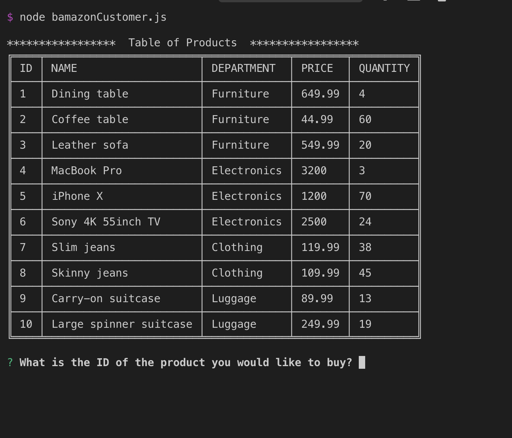

# :link: Me on GitHub
* My [profile](https://github.com/ArsalanAtGH)
  * Repositories, pull requests, commits, and...
* My [portfolio](https://arsalanatgh.github.io)
  * Deployed projects

# :page_with_curl: Description
* A node.js console application

* 2 main apps: `bamazonCustomer.js` and `bamazonManager.js`

# :nut_and_bolt: Tools and Technologies
* Editor: `Visual Studio Code`
* Languages: `(vanilla) JavaScript`
* DB Server: `MySQL`
* Runtime Environment: `Node.js`
* Package Manager: `npm`
* Modules: `inquirer`, `mysql`, `table`

# :arrow_forward: Deployed application
* [Deployed application]() via GitHub Pages directly from the depository

# :tv: Demo
* To see a demo of this application, click [here](https://youtu.be/jGRjsO4kqg4) 

# :wrench: How to Run
1. **Clone down** the application to your local device.
2. **Install the packages** specified in `package.json`.
3. Get your **database** up and running.
    1. Start MySQL server
       * On Mac: Open **Spotlight Search**, type in **mysql**, then choose **mysql.prefPane**,
       enter your password, and finally hit **Start MySQL Server**
    2. Create schema using `schema.sql`
    3. Add data to your database using `seeds.sql`
    4. Modify port, user, and password in the corresponding `.js` to reflect your credential.
4. Open **terminal** (on mac)
5. If you wish to see it as a customer, **run** `$ node bamazonCustomer.js` and 
if you wish to see it as a manager, then **run** `$ node bamazonManager.js`.
6. **Follow instructions** on the console.
